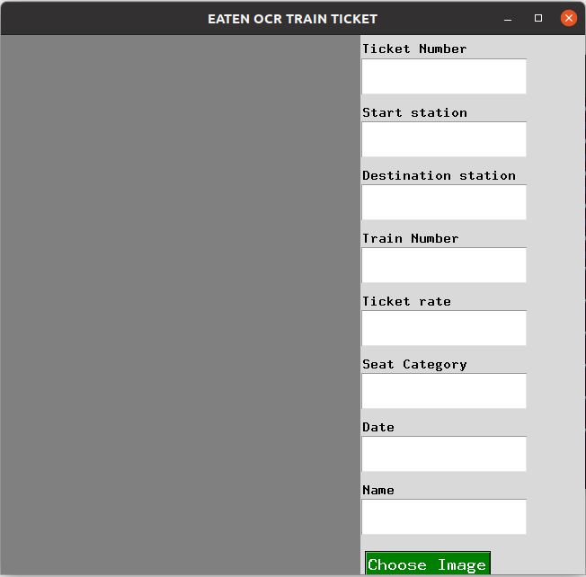
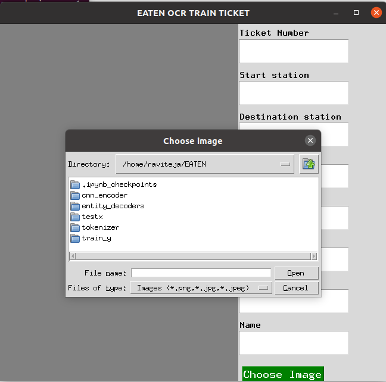
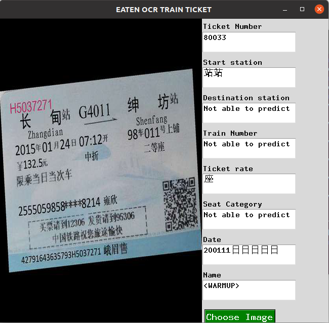
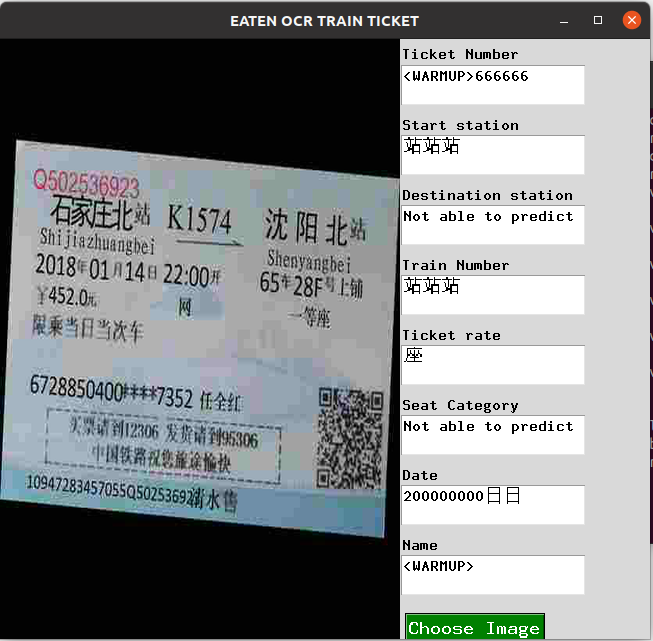

# Eaten-OCR
This is a repo containing tensorflow implementation of the paper [EATEN: Entity-aware Attention for Single Shot Visual Text Extraction](https://arxiv.org/pdf/1909.09380.pdf). This  is a single shot text extraction model for extracting  Entity of Interest. The data mentioned in the paper can be found [here](https://github.com/beacandler/EATEN). In the paper three different datasets were used namely train tickets, business cards,passport. The code in this repo is written for a subset of train tickets  dataset due to computational resources constrains,however it can be easily extended to all the three datasets which are mentioned in the paper with small changes to the code.

### Note: This implementation does not contain label smoothing as mentioned in the paper

## How to use?
Clone the git repo  and download the cnn encoder, entity decoders, tokenizers [from here](https://drive.google.com/drive/folders/1ihjfdPItzsO5u9f5wiuzevDl3Cy8Xuk2?usp=sharing) and then execute gui.py

### User Interface

